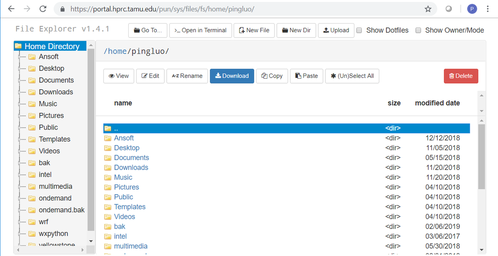
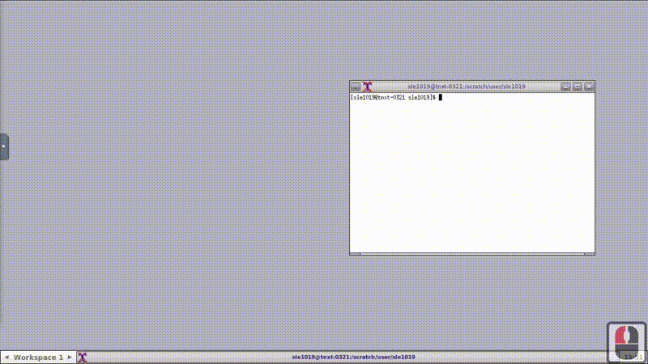
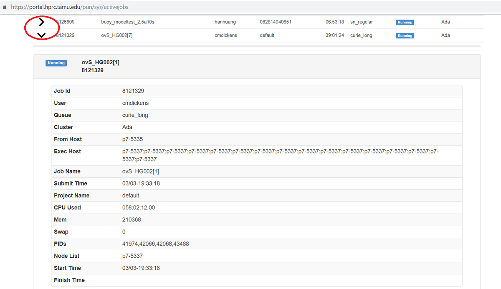
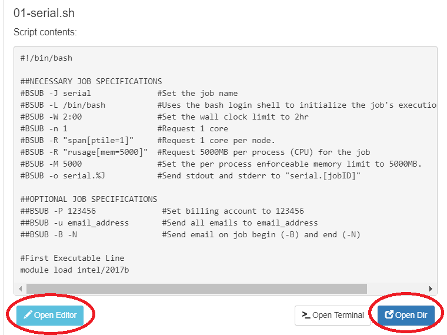

.. _ood:

OOD Portal
==========
What is TAMU HPRC OnDemand Portal
---------------------------------
The TAMU HPRC OnDemand portal is based on `Open OnDemand <https://openondemand.org/>`_ , an open source web platform through which users can access HPC clusters and 
services with a web browser. The portal provides an intuitive and easy-to-use interface and allows new users to be instantly productive at using the HPC resources 
for their research, and at the same time, provides an alternative convenient way for experienced users to access the HPC resources. The portal has a flexible and 
extensible design that makes it easy to deploy new services as needed.

Services Provided
-----------------
* Job submission and monitoring
* File transfer and management
* File editing
* Shell access
* Interactive applications
 * Abaqus
 * Ansys
 * IGV
 * LS-PREPOST
 * Matlab
 * Jupyter Notebook
 * Paraview
 * VNC
 * Rstudio
 * JupyterLab
 * JBrowse

How to Access
-------------
We recommend you access the Grace or Terra portal through their landing page at

      https://portal.hprc.tamu.edu
      
Click the portal you want to connect. The portals are CAS authenticated. All active HPRC users have access to both portals using their NetID and password. You will only be authenticated once, and before your session expires, you can freely access both portals without further authentication.

If accessing from off-campus, the TAMU VPN is needed.

You can go directly to the Grace or Terra portal using one of the following URLs:

  https://portal-terra.hprc.tamu.edu
  
  https://portal-grace.hprc.tamu.edu

Two-Factor Authentication Requirement
*************************************
Starting October 1, 2018, the Division of Information Technology will require use of Duo NetID Two Factor Authentication on its Virtual Private Network (VPN) (connect.tamu.edu) service.

Duo provides a second layer of security to Texas A&M accounts.

If you are not already enrolled in Duo and plan to use VPN, you can enroll now at duo.tamu.edu. Enrolling is as easy as 1-2-3:

#. Choose your device and download the Duo Mobile app. (We strongly recommend the mobile app as the most user-friendly option.)

#. Start your enrollment at https://gateway.tamu.edu/duo-enroll/;

#. Remember: Once you sign up, you will need your Duo-enrolled device when you log in to most Texas A&M resources.

For more information, consult IT's knowledge base article for Duo: https://u.tamu.edu/KB0012105

Using the Portal
----------------
Each service provided by the portal is available at the navigation bar at the top of the page.

Files
*****
The first option in the navigation bar is the "Files" drop down menu. From this menu, a user can view a file explorer at either their home directory or scratch directory.

Some users may find the visual interface of the file explorer more intuitive than shell based file exploring. All files in the directory are shown on screen, along with the file tree or hierarchy.

Normal file management commands are available with the click of a button. These include:

* Viewing files
* Text editing
* Copy/Paste
* Renaming files
* Creating files
* Creating directories
* Deleting files
* File upload/download
The 'View' button will display the highlighted file in the browser, as long as the file type is supported by the browser. Luckily modern browsers support many different types of files, from simple text files, to image files, to complicated multimedia files. This feature can be very convenient and useful if you want to quickly review a file, since you don't have to download the file to your local machine first and then review it, as what you would be doing if you had connected to a cluster using putty or mobaxterm.

File Editor
***********
File editor allows you to edit a file selected. It cannot be accessed from the main menu, but is available through the File app or Job Composer. In File app, you first select a file, then click 'Edit' from the File app interface. Then a new tab will be opened and you can edit the file in the editor. In Job Composer, you can edit the job script by clicking 'Open Editor' at the bottom of Job Composer.

Cluster Shell Access
********************
Shell access to any of the three clusters is available from this drop down menu with one click. Shell access app is similar to ssh client such as Putty and MobaXterm. it allows users to login to a cluster with their NetID and password.

Copy/Paste can be done with hot keys. To copy text from the shell access terminal, highlight the text with a mouse, then the highlighted text will be coped into the clipboard. To paste a text from the clipboard to the terminal, type 'Ctrl+v'.

Shell access works with Firefox and Chrome only.

Copy/Paste in VNC
/////////////////
If launching an interactive session in the portal, there are a few extra steps that need to be taken. Please reference the media below, or the summary of steps below that for more information. 

#. Open the toolbar on the left of the screen and select "Clipboard".
#. If you want to paste text from your host computer to the remote session, paste the text in the clipboard box. You can then use the middle-mouse button (MMB) to paste it in your terminal.
#. If you want to copy text from the remote session to your host computer's clipboard, simply highlight the text in the terminal. It will appear in the Clipboard toolbar pop-out where you can copy it to your host clipboard.

Jobs
****
From the jobs drop down menu, a user can view their active jobs or compose and submit jobs using the job composer.

Active Jobs
///////////
The active jobs menu provides information about running jobs the cluster, including their JobID, name, user, account, time used, queue, and status. Clicking the arrow to the left of a given job will reveal more details, such as where it was submitted from, which node it's running on, when it was submitted, process IDs, memory, and CPU time.

Job Composer
////////////
When first launched, the job composer will walk the user through each of its features, covering the whole process of creating, editing, and submitting a job.

The job composer provides some template job scripts the user can choose from. Once a template is selected, you need to edit the template to provide customized job content. This can be done by clicking 'Open Editor' underneath the job script contents.

The job composer has a specific directory in the user's scratch to store the jobs it has created. We call the directory the job composer's root directory. New jobs created by the job composer will have a sub-directory in the root directory. The name of the sub-directory is same as the index of the job, which is an integer maintained by the job composer. The first job has an index 1, the second job has an index 2, and so on. Knowing this is very important to help us using the job composer more effectively.

There are two ways to cope with the default directory created by the job composer.

**Method 1:** using the default directory as the working directory of your job. This means you need to upload all input files to that directory before you can click the submit button. This can be easily done by clicking 'Open Dir' right beneath the job script contents. A file explorer will open the job directory in a new tab where you can do file transfers.

**Method 2:** if you already have the input files stored somewhere in the cluster and don't want to move them around, or you prefer to have an organized directories by yourself, you can simply add one command line in the job script before any other command line, where /path/to/job_working_dir is the directory you want all the commands to be executed:

.. code-block:: php

      cd /path/to/job_working_dir
   
Common Problems
***************
#. The session starts and quits immediately.

      Check your quota in your home and scratch. If you see a full or close to full usage, clean your disk space and try again.

#. In ANSYS Workbench, not all windows are available in the foreground.

      Right click the bottom panel title bar "Unsaved Project - Workbench" and select maximize

Log out
*******
To properly log out the portal, you must do two things: (1) log out the portal by clicking 'Log out' from the top navigation bar; (2) close the browser to completely terminate the session.

**Be aware that only logout of the portal is not enough. You must also close the entire browser (not just the tab)**, a side effect of CAS. This is very important if you are using a public computer.

Cleanup
*******
The portal stores temporary files for interactive apps in $SCRATCH/ondemand/data/sys/dashboard/. Although the disk space used by those files accumulate slowly, it is a good habit to clean this directory periodically.

.. code-block:: php

      rm -rf $SCRATCH/ondemand/data/sys/dashboard/batch_connect/sys/*
      

Interactive Apps
----------------
Each piece of software listed above in the "services provided" section is directly available to launch from this menu. When a piece of software is selected, you will see the interface for job parameters such as number of cores, wall time, memory, and type of node. If you are not sure what to change, the default values work fine. Once you fill out the form, click 'Launch' and the app will be launched as a job. It will first go into a queue, and when ready, a button will become available to view the interface of the chosen software.

Interactive sessions can be managed via the "My Interactive Sessions" button on the navigation bar.

We have tried to provide the most commonly used GUI software packages on the Interactive Apps drop-down menu. If a software is not available, you can always run it within VNC, which is provided on the drop-down menu. To run a GUI application in the VNC session on the portal, follow these steps.

#. Click 'VNC' from 'Interactive Apps' and start a vnc session. 
#. In the terminal within the new tab, load the module for the software you want to run. 
#. If you have chosen a GPU node, please run
